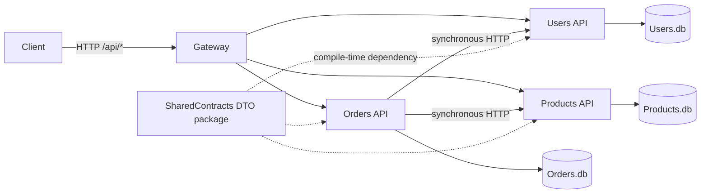
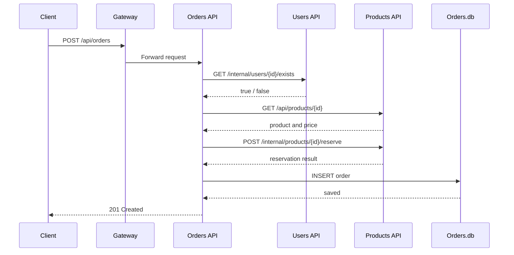

# Distributed Modular Monolith

> **Educational sample, not a production recommendation.** This solution deliberately shows a system that has been physically distributed without gaining microservice autonomy. All components share release `1.0.0` and are deployed together.

## What is it?

A distributed modular monolith keeps recognizable business-module boundaries but runs those modules in separate processes. Here, **Users**, **Products**, and **Orders** are ASP.NET Core APIs with separate SQLite databases. They live in one repository and solution, consume one DTO assembly, form one release unit, and are expected to be deployed as a set. Network calls replace in-process calls, but organizational and lifecycle coupling remain monolithic.

Each service project uses `Api`, `Application`, `Domain`, and `Infrastructure` folders. Only transport DTOs are in `SharedContracts`; entities and DbContexts remain private. Separate databases demonstrate data ownership, not independent service autonomy.

## Architecture



All four processes are launched by the same Compose file. The gateway only reverse-proxies public routes; it contains no authentication or business logic.

## Create order: deliberate runtime coupling



These calls are sequential and synchronous. If Users or Products is unavailable, `HttpClient` fails and order creation fails. There is deliberately no queue, event bus, Saga, retry workflow, local replica, or eventual consistency. Product stock is atomically decremented before the order is saved; a later Orders database failure can therefore leave inconsistent stock. That weakness is intentional and makes the distributed transaction problem visible rather than hiding it behind production patterns.

## Why this is **not** microservices

Process separation, HTTP, containers, and database-per-service are not sufficient to create microservices. This example intentionally has:

- **Synchronous communication:** Orders blocks on Users and Products.
- **Runtime dependencies:** an Orders capability is unavailable when either dependency is down.
- **Coordinated deployment:** `docker compose up --build` deploys the complete application.
- **One shared release version:** the gateway and all modules are version `1.0.0`; there is no compatibility/version matrix.
- **One repository and solution:** changes and validation happen as a single codebase.
- **Shared DTO contracts:** all services compile against the same contract project and must upgrade together.
- **No independent versioning or deployment lifecycle.**
- **No asynchronous messaging or eventual consistency.**
- **No service autonomy:** module boundaries organize code, but the whole is operated and released as one product.

A genuine microservices approach normally emphasizes independently deployable, independently evolvable services and team ownership. This sample intentionally pays network/distribution costs while retaining a monolithic release lifecycle.

## Benefits

- Clear Users, Products, and Orders boundaries make the domain easier to navigate.
- Separate processes and databases provide fault-boundary and integration-call learning opportunities.
- A single repository, contract package, and release can simplify coordination for one small team.
- It can expose hidden coupling before an organization attempts independently deployed services.
- Individual processes can be observed or provisioned separately, even though the release remains coordinated.

## Costs and risks

- More latency, serialization, networking, containers, logs, and operational failure modes than an in-process modular monolith.
- Poor availability amplification: CreateOrder needs three APIs to be healthy at the same time.
- Contract and deployment changes require cross-module coordination.
- No distributed transaction protects stock and order persistence.
- Shared contracts and release cadence inhibit independent evolution.
- Testing and local development require several processes.
- It can become a “worst of both worlds” architecture if distribution has no concrete benefit.

## Typical use cases

This shape can appear during a staged extraction from a monolith, when legacy deployment governance mandates one coordinated release, when one team owns a modest system that needs process isolation, or as a teaching environment for distributed-system failure modes. It is often transitional before either returning to a simpler modular monolith or investing in true service autonomy. It should be chosen deliberately, not treated as microservices by default.

## Comparison

| Style | Runtime shape | Data and calls | Deployment/ownership | Difference from this sample |
|---|---|---|---|---|
| Monolith | One process, often layered | Commonly one database; in-process calls | One release | This sample splits modules into processes and databases, adding network failures. |
| Modular monolith | One process with enforced module boundaries | Usually in-process contracts; data may be schema-separated | One release | It retains the same coordinated lifecycle without paying synchronous network costs. |
| SOA | Coarser enterprise services integrated through governed contracts, often an ESB/orchestration layer | May use shared enterprise schemas and heterogeneous protocols | Organization-wide governance is common | This sample has no ESB, central orchestration, canonical enterprise model, or reusable enterprise services. |
| Microservices | Many small autonomous services | Private data; resilient APIs and/or asynchronous messages | Independent releases, versions, scaling, and team ownership | This sample explicitly rejects independent lifecycle and asynchronous decoupling. |
| **Distributed modular monolith (here)** | Three module APIs plus gateway | Private SQLite databases; synchronous HTTP; shared DTOs | **One coordinated release** | Modular code and distributed runtime, but monolithic change/deployment boundaries. |

## Run

Prerequisites are Docker and Docker Compose:

```bash
cd src/SystemArchitectures/DistributedModularMonolith
docker compose up --build
```

The gateway listens at `http://localhost:5100`. Create a user and product, then use their returned IDs:

```bash
curl -X POST http://localhost:5100/api/users/ -H 'Content-Type: application/json' -d '{"name":"Ada","email":"ada@example.test"}'
curl -X POST http://localhost:5100/api/products/ -H 'Content-Type: application/json' -d '{"name":"Keyboard","price":99.00,"stock":10}'
curl -X POST http://localhost:5100/api/orders/ -H 'Content-Type: application/json' -d '{"userId":"<user-id>","productId":"<product-id>","quantity":2}'
```

Public capabilities are create/get/update User, create/get/update-stock Product, and create/get/cancel Order. Swagger UIs are available inside each service container; the gateway intentionally exposes only business routes.

## Boundaries and intentional omissions

`SharedContracts` contains request/response records only. It does **not** contain EF entities, domain models, DbContexts, or repositories. Each service owns its own SQLite volume. There are exactly three business modules. RabbitMQ, Kafka, event buses, Sagas, asynchronous workflows, authentication, and independent service versions are intentionally absent so the lesson remains focused: **distribution does not by itself make microservices**.
